# MythTV Leanback Frontend (leanfront): Android TV frontend for MythTV

Leanfront is a frontend for MythTV that runs on Android TV and Amazon Fire TV devices.
Leanfront supports playback of recordings and videos from MythTV. It can also schedule recordings using voice search or a program guide, and search for recordings or videos using voice.

Leanfront can be installed from the [Google play store](https://play.google.com/store/apps/details?id=org.mythtv.leanfront) or the Amazon store, depending on your device. 

<details><summary>Table of Contents</summary>

- [Main Screen](#main-screen)
- [Recording Group Screen](#recording-group-screen)
- [Detail Screen](#detail-screen)
- [Related Videos](#related-videos)
- [Videos Screen](#videos-screen)
- [Playback Screen](#playback-screen)
- [Search](#search)
- [Tools](#tools)
- [Settings](#settings)
- [Backend Status](#backend-status)
- [Manage Recordings](#manage-recordings)
- [Program Guide](#program-guide)
- [Recording Rules](#recording-rules)
- [Upcoming Recordings](#upcoming-recordings)
- [Schedule Recording](#schedule-recording)
- [Installing leanfront](#installing-leanfront)
- [History](#history)
- [Leanfront Features](#leanfront-features)
- [Release Notes](#release-notes)
- [Playback](#playback)
  - [Frame Rate Synchronization](#frame-rate-synchronization)
  - [Bookmarks and Last Play Position](#bookmarks-and-last-play-position)
  - [Commercial Break and Cut List](#commercial-break-and-cut-list)
- [Live TV](#live-tv)
- [Playback controls](#playback-controls)
  - [Top Row of Controls](#top-row-of-controls)
  - [Progress Bar](#progress-bar)
  - [Bottom Row of controls](#bottom-row-of-controls)
- [Playback Menu](#playback-menu)
- [Remote Control](#remote-control)
- [General Operation](#general-operation)
  - [Status Port](#status-port)
  - [Screen saver and idle shutdown](#screen-saver-and-idle-shutdown)
  - [Videos and Recordings](#videos-and-recordings)
  - [Parental Level](#parental-level)
  - [Refresh Lists](#refresh-lists)
  - [Copy from one Android device to another](#copy-from-one-android-device-to-another)
    - [Important Notes](#important-notes)
- [Problems](#problems)
  - [Error handling](#error-handling)
  - [Debugging](#debugging)
- [Android Phones / Tablets with touch screen](#android-phones--tablets-with-touch-screen)
  - [Program List](#program-list)
  - [Details page](#details-page)
  - [Playback](#playback)
- [Install on Laptop or Desktop](#install-on-laptop-or-desktop)
- [Building](#building)
- [Internationalization](#internationalization)
- [License](#license)

</details>


## Main Screen


- The main screen shows a horizontally scrolling list for each recording group. One icon is shown per series.
- Select a group name or All on the left and press enter to see the [Recording Group Screen](#recording-group-screen).
- Selecting an episode icon opens a [Detail Screen](#detail-screen).

<details><summary>Recently Viewed List</summary>

The top line of the main screen shows "Recently Viewed" items if that option is selected in Settings. This helps you keep track of what you are watching.
Recommended Settings:

- Enable recently viewed list in settings.
- Enable deleted and watched items in the recent list.
- Enable "Trim recently viewed list" to only see the latest episode of each series you are watching.
- Disable deleted and watched items in the "related" list.
- In mythfrontend, set the deletion delay for deleted shows to 7 days or longer.

Now, for example, if you watched and deleted an episode yesterday, the deleted episode shows at the front of the recent list. Select that episode from the recent list. Go down in the details screen to the related list. You will see unwatched, undeleted episodes of the series and you can select one to play.

</details>

<details><summary>More details</summary>

- A list of recording groups is displayed on the left with titles in the group in a scrolling row on the right. Next to each icon on the left is a number that represents the number of entries on the right in that row. This is not necessarily the same as the number of recordings because on the main screen there is one entry per series. Select a group and press enter to open the screen with that group's contents. Once a group is open there is one entry per episode.
- You can customize what is shown and the order in which it is shown, using the [Settings](#settings) icon in the [Tools](#tools) row at the bottom of the page.
- The LiveTV group shows recordings already made from Live TV as well as channels available to watch live.
- On the top-level screen only, there is a list of recently viewed items. This can be customized in settings to select how far back it goes or to disable it entirely.
- There is a row for "All" at the top.
- If you have Videos in the Video storage group on the MythTV backend, there is a row at the bottom showing videos organized by directory. Selecting that row and pressing enter opens the [Videos Screen](#videos-screen)
- There is a row labeled "Tools" at the bottom. There are various options available there.
- Indicators next to recordings show 🗑 for deleted, 👁 for Watched, 💥 for damaged.

</details>

## Recording Group Screen

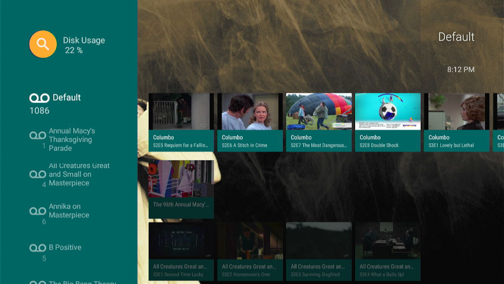

- This screen shows one row for each series with episodes listed across.
- Selecting an episode icon opens a [Detail Screen](#detail-screen).

<details><summary>Working with a series</summary>

 Select the header for a series and do a "long press" or press the menu button if your remote has one. You will get a menu that lets you mark the entire series as watched or unwatched, delete or undelete it, remove bookmarks, allow rerecord or remove from recently watched list.

</details>

<details><summary>Paging</summary>

Scroll through the list using up/down arrows and left/right arrows. This can be slow when there is a long list of shows or episodes. You can now use the Fast Forward and Rewind buttons of the remote to get though these lists more quickly. When the header (left hand) pane is visible, Fast Forward will scroll down a page at a time. When the header pane is not visible, Fast Forward will scroll across one row a page at a time.

If you don't have Fast Forward and Rewind buttons, Page Down / Page Up, or Play Next / Play Previous can be used. You can connect a bluetooth keyboard and use these combinations. You can also buy a Bluetooth remote that has multimedia buttons including Fast Forward and Rewind.

</details>

## Detail Screen
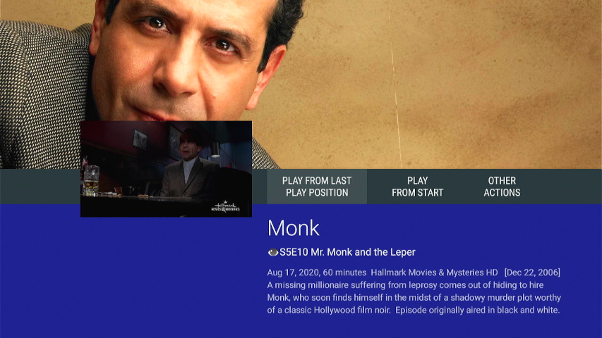

- Here you can play the episode or video or take other actions, including delete, mark as watched, etc.
- Pressing down arrow on the remote displays the list of [Related Videos](#related-videos). These are other episodes of the series. 
- There are buttons for Playback and for "Other Actions". "Other Actions" presents a menu for deleting the program, marking watched, etc. If you have a menu button on your remote, pressing that will also bring up the "Other Actions".

## Related Videos


See this by pressing Down on the Detail Screen. A horizontal list of other episodes of the series is shown, If you have selected a recording from the main page and you actually want to see a different episode of the series, you can find it here.

## Videos Screen
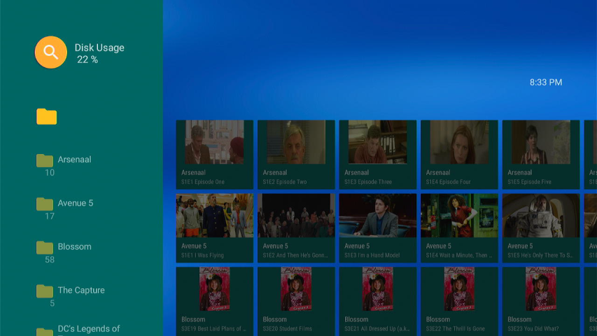

Videos from the Videos part of MythTV are shown here, organized by directory. You can drill down to subdirectories or play videos from this screen. 

<details><summary>Operating on a directory</summary>

Select the header for a video directory and do a "long press" or press the menu button if your remote has one. You will get a menu that lets you mark the entire directory as watched or unwatched,remove bookmarks or remove from recently watched list.

This operation is not recursive. If there are subdirectories in a video directory, any operation on the directory will be performed on videos in that directory only.

</details>

For information on paging through videos see the Paging section of [Recording Group Screen](#recording-group-screen).

## Playback Screen


- During playback you can use the Menu button to show a menu of actions. A normal press of Enter shows [playback controls](#playback-controls) with icons for actions. The menu can be selected from an icon here if you do not have a Menu button.
- Commercial skip is supported if the recording or video has been flagged in MythTV. Skipping with arrow keys and fast forward/rewind keys is supported. These can be customized in [settings](#settings).
- For more information see [Playback](#playback).

## Search
Select the magnifying glass at the top left hand side of most screens, and press enter. You will see the following:

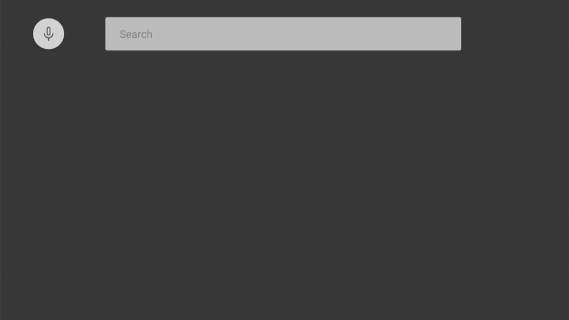

- On a non-FireTV Android device, you can speak when the microphone is selected. You can skip the keyboard step below.
- On Fire Stick or Fire TV, Select the text box in the screen above. Press Enter. You will see the keyboard below:

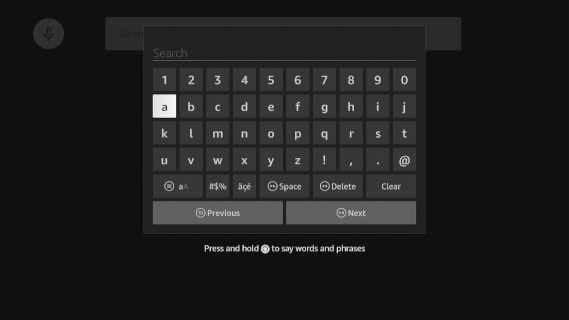

- On a Fire Stick, press the microphone button on the remote and speak your search. Select Next.
- If you get to the keyboard on a generic Android device, select the microphone icon, press enter and speak.
- Search results are as shown below:

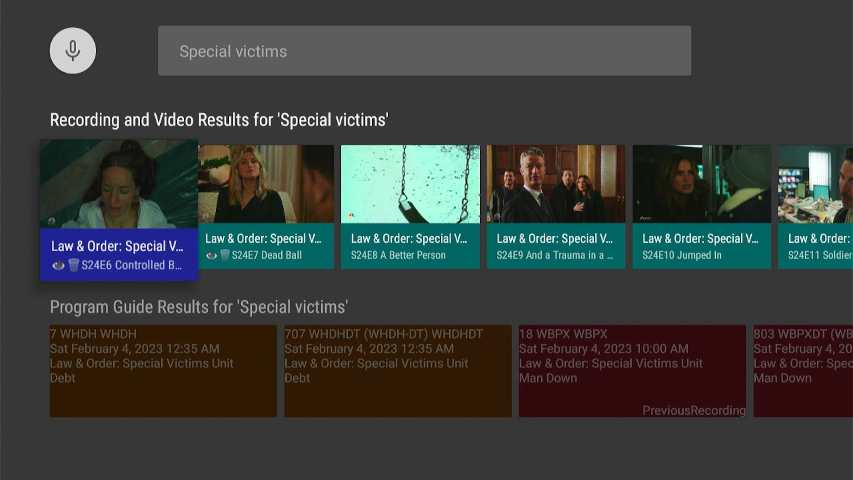

- Select any video that was found and play it or play a [Related Video](#related-videos).
- Select any program guide result to schedule a recording, or edit a recording rule.

## Tools
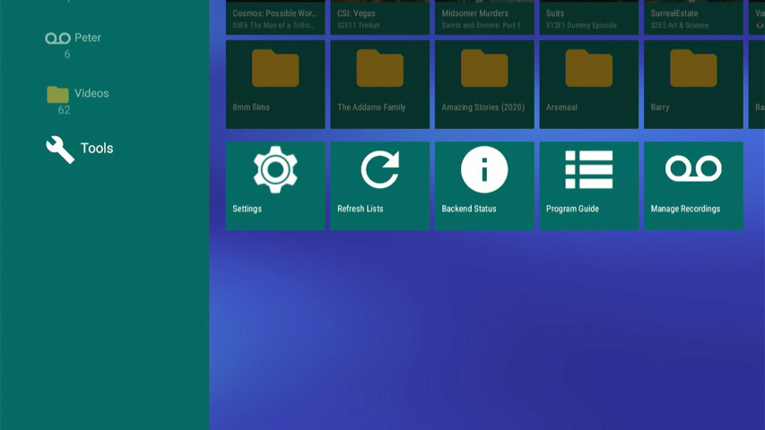

At the bottom of each list screen is a row named "Tools", that provides application-wide tools.

- [Settings](#settings) provides for customization of many features of leanfront.
- [Refresh Lists](#refresh-lists) refreshes the recording and video lists from the backend. This is rarely needed, as leanfront automatically keeps up to date with the backend. The frequency with which it is updated can be set in [Advanced Settings](#advanced).
- [Backend Status](#backend-status) shows general information about the backend.
- [Program Guide](#program-guide) Shows the program guide and provides the ability to watch Live TV and schedule recordings.
- [Manage Recordings](#manage-recordings) Shows the program schedule and provides the ability to schedule recordings.

## Settings
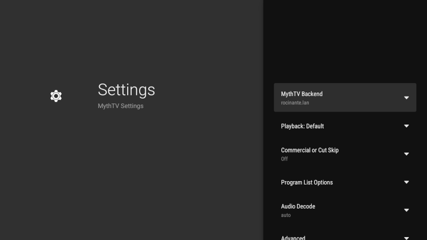

<details><summary>Notes</summary>

### MythTV Backend

If your backend has been set up to require user authentication for the service API, you will see user Name and Password prompts. Leanback needs these to communicate with the backend. These do not show iff you do not have a user authentication requirement, so most people will never see these prompts.

### Playback groups

If you have playback groups defined in mythfrontend, the Playback section is repeated for each playback group. The settings can be varied for each playback group. When adding a playback group in mythfrontend, the new playback group will have default settings in leanfront. If you have a setting that you want to change for all playback groups, you have to set it here in each playback group.

### Advanced

The advanced section of settings includes a value that may need to be changed to suit unusual circumstances. Be careful when changing it as you may cause bad things to happen if you use inappropriate values.

- **TS Search Packets.** Increase this if when playing a recording or other TS file, the recording length does not show in the OSD, and you cannot use skips or bookmarks. The default value supplied with exoplayer is 600. I have set a default value of 2600 in leanfront. The value is limited to a range of 600 - 100,000. Increasing the value will cause the start of playback to take longer and use more memory. Also skips forwards and back will take longer. Thus it is best to make this the smallest value that works for you.

- **Maximum Recordings/Videos to load.** Leanfront can handle an unlimited number of recordings and videos. However loading huge numbers of recordings and videos results in excessively long times to load the listing. WIth 60,000 recordings it takes about 3 minutes to load he list from the backend and another 3 to 4 minutes to format the display. To avoid this, the system defaults to loading the only the most recent 10,000. If you are happy with waiting minutes for the screen to refresh, you can increase the value. If you want a quicker refresh you can reduce the value.

- **Number of Minutes Between Backend Refreshes.** The system refreshes the list periodically from the backend to pick up new recordings or changes. This setting must be a multiple of 4. If you need to see recordings in the list as soon as possible, set a low number. If you have a huge number of recordings it may take long to refresh so this setting may not help. In that case adjust the  **Maximum Recordings/Videos to load** setting.

- **Status Port uses SSL (EXPERIMENTAL)** If you have SSL enabled on the backend, and your domain is registered, leanfront can communicate via SSL. This seems an unlikely situation, requiring a lot of work and expense and having no real advantage if you are using leanfront on your local network. It is marked as experimental because there are problems with random 408 errors from the server. That results in some slow responses and missing artwork. If anybody seriously wants to use SSL, I can investigate this and see what fix is possible. Open an issue in github.

</details>

## Backend Status
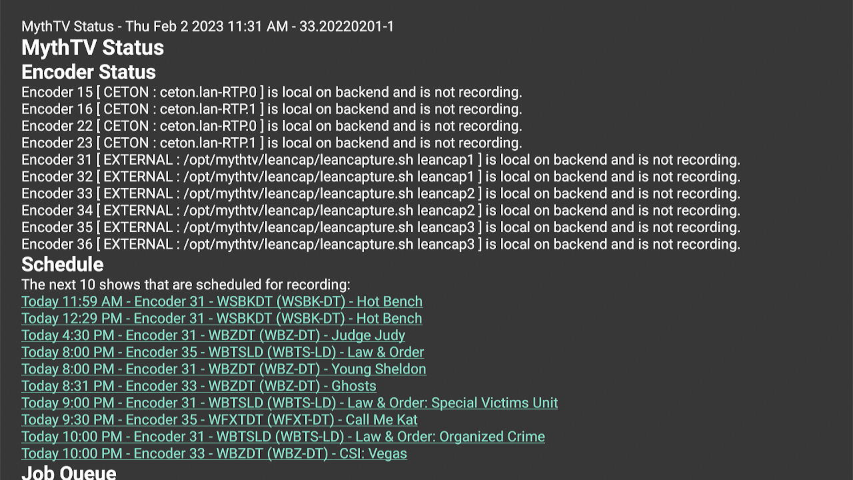

Backend status can be scrolled down using arrow keys.

## Manage Recordings


There are three rows available.
- [Upcoming Recordings](#upcoming-recordings).
- [Recording Rules](#recording-rules)
- [Program Guide](#program-guide)

## Upcoming Recordings


[Edit](#schedule-recording) a recording rule by selecting the name or the pencil icon on an upcoming recording and pressing Enter. Create an override rule for one showing or one episode by selecting the paperclip icon. The "Show All Status Values" checkbox allows you to see showings that are not to be recorded. This allows you to select one of the excluded showings so that it can be overridden or scheduled.

## Recording Rules
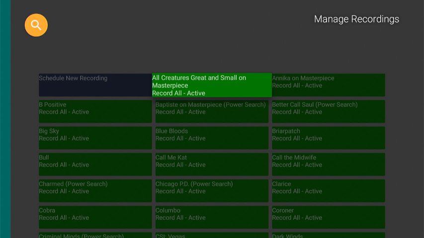

- [Edit](#schedule-recording) an existing rule by selecting it and pressing Enter.
- Create a new manual recording by selecting *Schedule New Recording* and pressing Enter.

## Program Guide
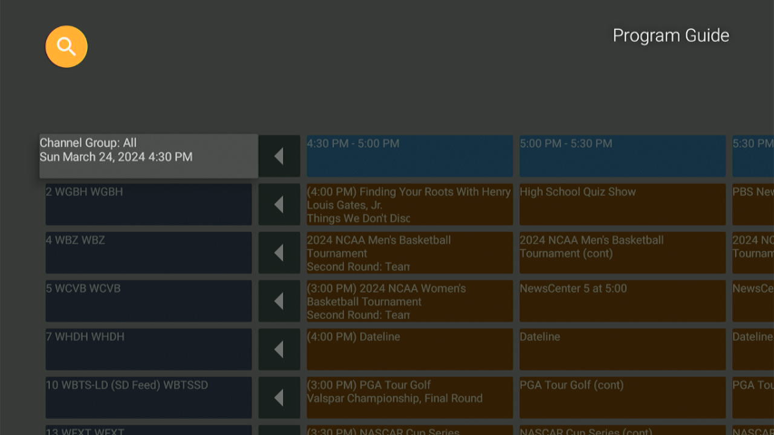

- Play Live TV on a channel by selecting the channel, pressing enter and selection "Play Live TV". For more information see [Live TV](#live-tv).
- Jump to a desired channel by selecting and pressing enter on one of the channel cells, and entering a channel number with the onscreen keyboard.
- Jump to a desired date and time by pressing enter on any of the date or time cells and selecting a date and time.
- [Schedule](#schedule-recording) a recording by pressing enter on a program cell.
- Move to the next or prior time slot of guide data by pressing enter on any of the arrow cells.

<details><summary>Paging</summary>

Scroll through the list using up/down arrows and left/right arrows. This can be slow when there is a long list of channels. You can now use the Fast Forward and Rewind buttons of the remote to get though the list more quickly. Fast Forward will scroll down 45 channels at a time (5 pages).

If you don't have Fast Forward and Rewind buttons, Page Down / Page Up, or Play Next / Play Previous can be used. You can connect a bluetooth keyboard and use these combinations. You can also buy a Bluetooth remote that has multimedia buttons including Fast Forward and Rewind.

</details>

## Schedule Recording


The page that updates recording rules is similar to the corresponding page in mythfrontend.

<details><summary>New Episodes Only</summary>

The feature "New Episodes Only" is disabled unless you have a recent build of mythbackend. There is a bug in older versions of mythbackend that prevents this from working.

</details>

<details><summary>TV or Movie Metadata</summary>


When adding or updating recording rules, the metadata section includes a search to find the correct movie or series id.

There are three options for TV shows, TheTVDB, TVmaze and TMDB. For movies there are two options, TheTVDB and TMDB.

If the show that has been selected has a different name from what is shown in the schedule, you can search on this different name, by changing the search phrase. For example, PBS shows are often called "xxxx on Masterpiece", for example "Poldark on Masterpiece". In this case, searching for "Poldark on Masterpiece" finds nothing, but by changing the search phrase to "Poldark", you can find the series details.

You can use TheTVDB, TVmaze or TMDB, as long as you have a recent backend that supports the option. If your show is not found on one service, you can try the others. This does not depend on the default lookup method selected in mythfrontend. In mythfrontend you can select TheTVDB, TVmaze or TMDB as the default. Even if you have selected one as the default, you can still use another for specific record rules.

</details>


## Installing leanfront
You need an Android TV device, which can be a [Nvidia Shield](https://www.nvidia.com/shield), [Amazon Fire TV stick](https://www.amazon.com/dp/B08XVYZ1Y5/), [Amazon Fire TV](https://www.amazon.com/dp/B08SVZ775L), or other name brand or generic Android TV device.

### Amazon Fire TV
If you have an Amazon Fire TV, Fire Stick or Fire Cube, you can install from Amazon App store.
For a new installation, just press the microphone button on your remote and say "MythTV". Alternatively, log on to amazon.com, search for MythTV or leanfronte, and request it to be installed to your device.

If you already have leanfront installed by downloading from orangedox, to install from the app store you will have to first uninstall it.

### Non Amazon devices
Leanfront is available in the [Google Play Store](https://play.google.com/store/apps/details?id=org.mythtv.leanfront), for TV devices. Either go to play.google.com or use the play store from the android device and search for MythTV or leanfront. If you have previously installed an apk from orangedox.com, you do not need to uninstall, the play store will upgrade it.

### Side Load
Preferably use the play store or app store for installation.

Packages are also available here, in case you want to install on a phone or tablet, or cannot install from the play store: https://drive.google.com/drive/folders/1LMf7dTK_fD_e1S3S2HgB1NEPsWI0MdyB

To install a side load version you can download the apk file from the above link. Put it on your android device using direct download, a USB cable or another method. Open a file manager, select the apk file and tap on it to install. Alternatively you can use adb to install from a computer if you have developer mode enabled on the android device.

### After Installation
The first time you run the app it will prompt you for the MythTV Backend settings. Supply the IP address or DNS name of the master backend. If you have MythTV V32 or V33, change the [status port](#status-port) from 6544 to 6744. (Note that 6544 still works but does not support the latest features). In V34, port 6544 now has full support. In future port 6744 may be removed.

## History

Leanfront is based on the sample [Videos By Google](https://github.com/android/tv-samples/tree/main/Leanback) app, designed to run on an Android TV device. It uses the Leanback Support library which, according to the author, "enables you to easily develop beautiful Android TV apps with a user-friendly UI that complies with the UX guidelines of Android TV".

## Leanfront Features

- 4K video plays at 60fps with full 4K resolution. This is currently not achievable with the android port of mythfrontend.
- The application uses exoplayer, which is the player code used by youtube, Amazon Prime and others. As such it will be able to handle new capabilities that are released on Android TV.
- It plays recordings, videos and Live TV from a MythTV backend. All recordings are presented in a way that is consistent with other leanback applications. The first screen shows a list of recording groups. You can drill down to a list of titles in a recording group.
- This application uses the MythTV Service API to communicate with the backend. It needs no access to the database password, and will work on all versions of mythbackend from v29 onwards. It may work on older versions if the APIs are available on the MythTV backend.
- Voice search within the application is supported, for recordings, videos and programs in the guide.
- With backend on master or recent MythTV v30 or later this frontend will prevent idle shutdown on the backend. On older backends you need to take steps to ensure the backend does not shut down while playback is occurring.
- Bookmarks are supported. Bookmarks can be stored on MythTV or on the local leanback frontend (for recordings or videos). In order to store bookmarks for videos on MythTV you need backend version v32-Pre-658-g48557d32c2 or later or v31.0-73-g7bf1284867 or later. If you have an earlier version that does not support the Video/GetSavedBookmark and Video/SetSavedBookmark methods, the bookmarks for videos will be stored locally on the android device.
- There is a setting option to always store bookmarks locally if you prefer. That way each android device can have its own bookmarks, so that if different people are watching separately and at different places in the recordings, they can keep track of bookmarks separately.
- Last Play Position is supported on versions of MythTV that support it. The last play position is always stored on the backend.
- The "Watched" flag is set if you get to the end of the recording or video during playback. To ensure it is set, press forward to get to the end before exiting playback.
- There is a delete/undelete option so that you can delete shows after watching. Also there set watched or unwatched and remove bookmark options.
- There is a "Stop Recording" option that stops a recording. This works whether the recording was scheduled or is "Live TV" in progress.
- There is a zoom icon and an aspect icon so that you can expand letterbox recordings and correct wrongly stretched recordings.
- There is an icon to move the enlargement up, down, left or right. If you want to hide a ticker at the bottom, you can enlarge then move up, which will leave the top in place and enlarge downwards so that the ticker is off screen.
- Videos do not currently support deletion.
- Wakeup of master backend is supported via setup.
- Sort order of recordings can be customized.
- Subtitles (Closed captions) are supported. There is a setting to change the size of subtitles.
- At the end of a recording playback, you can advance to the next episode or any episode without returning to the main list.
- You can play in-progress recordings and the application will follow the progress as the recording continues.
- Video playback is exclusively via hardware assisted Mediacodec.
- Audio playback is supported using mediacodec (hardware) or ffmpeg (software). By default it will use mediacodec if it can, and will switch to ffmpeg if there is a media format not supported by mediacodec. There is a setting where you can change this default and force either mediacodec or ffmpeg.
- Audio playback supports digital pass-through for AC3 and other digital formats if they are supported on your sound system. It also supports down-mix to stereo if you do not have a system that supports AC3.
- Selection of alternate audio tracks during playback.
- Playback from slave backends is supported.
- Playing of Live TV is supported.
- Synchronization of TV refresh rate to match frame rate, if selected in setup.
- Display Program Guide, create recording rules, update recording rules.
- The *Master Backend Override* MythTV setting is supported. Playback will be from the master backend even for recordings made on a slave. However the Preview image still uses the slave backend, so it will not show if the slave is down.
- Adjustment of Audio Sync in case a recording has a lip-sync problem.
- Support for touch screen devices is usable, although it is not perfect.
- Metadata lookup when scheduling recordings supports the tv db, tvmaze and tmdb.
- Note that some phones do not support MPEG-2 playback. There may be some android TV devices that do not support MPEG-2. NVidia shield supports MPEG-2 although there is a pixelation bug on some channels. Fire stick models since 2018 support MPEG-2. See https://developer.amazon.com/docs/fire-tv/device-specifications-fire-tv-streaming-media-player.html?v=ftvstick4k and select your model for full details.
- Supports playback groups, allowing different values per playback group.
- Now supports MythTV commercial breaks and cut list.

## Release Notes

You can see a list of changes in each version by looking at the commit list in github. See https://github.com/bennettpeter/android-MythTV-Leanfront/commits/master .

## Playback

- Pressing Enter or Down brings up the OSD playback controls. Note if you have enabled up/down jumping then Down will cause a jump instead.
- Pressing Back dismisses the OSD controls. Pressing Up a couple of times will also dismiss them. This is better because you will not accidentally end playback if you press Up when they are already timing out.
- Left and right arrow will skip back and forward. Holding down the arrow moves quickly through the video. The number of seconds for forward and back skip are customizable in Settings.
- Up and down arrow can be used for bigger jumps by setting a jump interval in settings. I recommend against using this because it interferes with navigation in the OSD. You can move very quickly through playback by holding down left or right arrow, so jump is not really needed. Jumping can be disabled by setting blank or 0 in the jump interval in Settings. When jumping with up and down arrows, the arrow buttons are disabled for up/down use in the OSD, and this can cause confusion.
- You can customize the up/down, left/right and ff/rew buttons to skip, jump or commercial skip.
- If you are playing a recording that is in progress of being recorded or a LiveTV channel, the behavior will be as follows. When you start watching, the OSD will show the duration being as much as has been recorded at that time. This duration will remain at that figure as you continue watching. Once you get to that point in the recording, there is a slight pause, then playback continues, with duration shown as "---", which means unknown duration. While in this state, if you press forward or back skip, it will revert to showing the amount recorded to date, and perform the forward or back skip requested. When you eventually get to the end as it was when you did the skip operation, it will revert to duration showing as "---" while playback continues.

### Frame Rate Synchronization

 If you are playing a video or recording that was recorded at a different frame rate from the default for your android device, motion may appear jerky. Frame Rate Synchronization fixes this by changing the refresh rate of your TV to match the frame rate of the video. Select "Match original frame rate" in the playback settings. With Amazon Fire TV Stick you also need to enable the "Match original frame rate" setting in the Fire TV settings.

### Bookmarks and Last Play Position

Bookmarks in a recording or video can be stored in the android device or in the MythTV backend. In Settings, Playback you can select an option to store them locally. On versions of mythbackend before v32-Pre-658-g48557d32c2 or v31.0-73-g7bf1284867, video bookmarks are always stored locally.

Bookmarks must be set explicity using the bookmark OSD option of playback menu. They can be removed from the video details page menu.

Last Play Position is always set upon stopping playback and the default on starting playback is to start at Last Play Position. It can be cleared from the Video deatils page menu.

If local bookmarks are not selected:

- Upon playback, if there is a local bookmark, it will be used. This can happen if you changed your local bookmarks setting after having already stored some local bookmarks. When exiting playback the bookmark will be stored on MythTV and the local bookmark erased. This can also happen if you upgrade your mythbackend to a version from v32-Pre-658-g48557d32c2 or from v31.0-73-g7bf1284867, the local video bookmarks will be used but will be cleared and set in MythTV from then on.

### Commercial Break and Cut List

If you run mythcommflag or comskip to detect commercials in a recording, or you use Edit mode in mythfrontend to add a cut list, leanfront now supports skipping over cuts or commercial breaks.

There is a Setting on the Settings page, "Commercial or Cut Skip". You can select "Off", "Notify", or "Automatically Skip". These apply to both flagged commercials and cut lists. If a cut list exists the commercial breaks are ignored.

If "Off" is selected, cut lists and commercial breaks flagged are ignored, and everything plays.
 
If "Notify" is selected, when a Cut or Commercial Break is encountered, a menu is displayed at the bottom left of the screen, with options "Skip" or "Do Not Skip". If you select "Skip", playback immediately skips to the end of the cut or commercial. If you select "Do Not Skip" or leave the meunu without selecting anything, it will continue playing. At any stage of playing in the cut or commercial, you can select "Skip" to go to the end.

If "Automatically Skip" is selected, playback will automatically skip each cut or commercial flagged.

The three options can also be selected or changed during playback by using the playback menu and selecting "Commercial or Cut Skip". Changes made here only affect the current playback.

You can skip forward and backward to the next or prior commercial break. This is similar to using the z and q keys in mythfrontend. Since there are very few buttons available on most android tv remotes, the Settings page allows you to reassign certain buttons to the skip commercial functions.

- You can set left/right, up/down, or rew/ff to commercial skip instead of their normal usage.
- The Playback Control Icons |< and >| will skip back and forward to the next commercial break. After the last break they skip to the prior or next episode in the series, as they have always done.
- If you have an advanced remote, the "Skip back" and "Skip next" buttons perform a commercial skip, while the "Step back" and "Step forward" buttons perform the "jump" operation of 5 minutes at a time or whatever value you set.

In the settings there are adjustments to start and end position that can be set. Setting a negative value means that it will skip that number of seconds early, setting a positive value will skip that number of seconds late. To make sure that absolutely no commercial is shown, you can make the skip larger by setting a negative value for start adjustment and a positive value for end adjustment. However you could miss a second or two of actual show. In the opposite situation, if you are unsure whether commercial skip works correctly, you can make the skip shorter by setting a positive value in the start adjustment and a negative value in the end adjustment. Then you will see a few seconds of commercial at the start and end of the break, so that you can be sure it is only skipping commercial and not skipping part of the show.

There is currently no way to edit a recording or video in leanfront. That can only be done in mythfrontend.

Leanfront also supports skip and cut lists in Videos in the "Videos" storage group. For this you need mythbackend version v33-Pre-925-gf702d54093 or later, and you need to use the new http port (6744).

## Live TV

There are two way to start Live TV viewing.

- In the LiveTV recording group are rows showing your TV channels, in groups of 100. If you navigate to a channel and press enter you will see a details page with the channel name and icon. There is a single button, "Play Live TV". Pressing this will start Live TV on that channel.
- In the Program Guide all channels from a selected channel group are shown. Clicking on a channel name allows Live TV to be started.

When Live TV is selected, either from the Live TV group or from the program guide, a recording is set up with the name and details of the current show in the program guide. When that program ends, it continues on to the next program in the guide, setting up a recording and playing it.

During Live TV it shows a "Record" button and menu item. Clicking this converts the temporary Live TV recording to a permanent recording in the Default group, and ensures the program is recorded to the end, even if you exit Live TV watching.

You can customize the display of rows in the Live TV group. Instead of groups of 100 channels, if you are using broadcast TV where there are fewer channel numbers and there may be sub-channels, you can set the number per row to a smaller number, e.g. 1 or 10. This is in the Settings under "Program List Options", near the bottom.

Notes:

- When starting Live TV playback, there is a delay of approximately 15 seconds while the channel is tuned and the recording is started. You will see a circling progress bar during this time.
- Live TV recording rules are created with priority -99. This means they will not preempt any recordings you may have set up for the same time slot.
- Live TV recordings made with leanfront will not honor the tuner LiveTV assignments in setup. They will use the tuners set up for recordings.
- If you invoke Live TV when there is no tuner available or the channel cannot be recorded, there will be a message, after a delay of around 30 seconds, informing you that the recording failed and giving a reason.
- If you have playback problems that you have to fix with ffmpeg or mkvmerge (see section "Problems" below), then this LiveTV feature will not work for you.
- LiveTV recordings are kept for the number of days specified in mythfrontend Setup->Video->General->Auto-Expire->Live TV Max Age, unless you use the "Record" button to make the recording permanent. 
- If you exit LiveTV by disconnecting the android TV device, or the device crashes, the cancel of the recording will not happen and it will continue to record the program. You can reconnect the android device, go into the LiveTV group and find the recording there. If it is still recording you can use the "Stop Recording" option from the "Other Actions" button. If you want to watch it you can do so from there.
- While watching Live TV, if the backend goes down and comes up again, it will resume the recording. You can go into the LiveTV group and stop it, or you can watch it from the LiveTV group.

## Playback controls


The following controls are available when pressing enter during playback. Select an icon and press enter to apply it. The name of the currently selected icon is displayed below the progress bar.

### Top Row of Controls

| Icon                  | Usage                                                                                                                                             |
|-----------------------|---------------------------------------------------------------------------------------------------------------------------------------------------|
| Play/Pause            | Switches between pause icon and play icon depending on the current state.                                                                         |
| Skip Previous         | Skip back to the previous commercial break, or to the prior episode if at the beginning of the recording (see [Related Videos](#related-videos)). |
| Rewind                | This skips back by the time set in the settings.                                                                                                  |
| Jump Forward          | This skips forward by the time set in the settings.                                                                                               |
| Skip Next             | Skip forward to the next commercial break, or to the next episode if there are no more commercials (see [Related Videos](#related-videos)).       |
| Change Playback Speed | Speeds up or slow down playback by increments to a maximum of 800%. Shows a seekbar where any desired speed can be selected in increments of 10%  |
| Playback Menu         | Shows a menu of playback actions that can be taken.                                                                                               |

**Note:** When using *Change Playback Speed* the program will disable digital audio pass-through if it is in use, by temporarily selecting *FFmpeg* audio decode. This will disable surround sound until you exit playback.

### Progress Bar

This shows playback position plus time played and total time. While this is focused you can use left and right arrows to skip back and forward. Holding the arrow down moves quickly through the recording. While this is focused, pressing Enter pauses and resumes.
Below the progress bar is displayed the description of the currently selected icon, if one is selected.

### Bottom Row of controls

| Icon                 | Usage                                                                                                                                                                                                                                                                                                              |
|----------------------|--------------------------------------------------------------------------------------------------------------------------------------------------------------------------------------------------------------------------------------------------------------------------------------------------------------------|
| Closed Captions      | Shows a menu of available subtitle tracks plus subtitle disabled. You can select one to change or disable subtitles                                                                                                                                                                                                |
| Picture Size         | Changes the picture size. Pressing this shows a seekbar. Left and right arrow fine tune the size. Up and down arrow select from several standard zoom amounts.                                                                                                                                                     |
| Stretch Horizontally | Stretch or squeeze the picture in case it is showing at the wrong aspect ratio.  Pressing this shows a seekbar. Left and right arrow fine tune the stretch. Up and down arrow select from several standard stretch amounts.                                                                                        |
| Move Picture         | If the picture has been resized, moves the picture up or down, left or right. Use up, down, left, right arrows to move it. For use when you want to cut off part of the picture, after zooming to a bigger size.                                                                                                   |
| Change Audio Track   | Shows a menu of available audio tracks plus audio disabled. You can select one to change or disable audio track.                                                                                                                                                                                                   |
| Adjust Audio Sync    | Shows a seekbar where you can change audio sync. Use this if lip sync is wrong. The value selected applies only to this playback, it is not saved after playback is ended.                                                                                                                                         |
| Autoplay             | Toggle automatic playback of all videos in the [Related Videos](#related-videos) list. When activated this displays in green color. At the end of each video or recording it will automatically start the next one. It will play watched or deleted items if you selected them in settings to be included in the [Related Videos](#related-videos) list. |

To see [Related Videos](#related-videos) while watching press down arrow. This shows other videos / recordings in the current group. You can select one of these to play instead of the current playing video.

## Playback Menu

During playback, you can see a menu of actions by pressing the Menu button on the remote or long-pressing the center button (hold down until the menu appears). Note that long-press does not work while the OSD is on screen. The menu contains most of the items in the OSD above.

## Remote Control

The Fire Stick and NVidia Shield have rather limited remote controls, however there are ways of connecting more advanced remotes, and a TV remote can be used to control the Android TV device using CEC. MythTV leanfront supports many media control keys that could be available.

| Key                 | Context      | Usage                                                                                 |
|---------------------|--------------|---------------------------------------------------------------------------------------|
| Back                | Playback     | If OSD is showing, close OSD. Otherwise Stop Playback and save bookmark               |
| Captions            | Playback     | Show menu of available captions (same as CC icon)                                     |
| DPad Left           | Playback     | Selectable in Settings: Skip back number of seconds set up or skip commercial         |
| DPad Right          | Playback     | Selectable in Settings: Skip forward number of seconds set up or skip commercial      |
| DPad Up             | Playback     | Selectable in Settings: Dismiss OSD and navigate in OSD, jump back or skip commercial |
| DPad Down           | Playback     | Selectable in Settings: Show OSD and navigate in OSD, jump back or skip commercial    |
| DPad Center         | Playback     | Show OSD                                                                              |
| Media Audio Track   | Playback     | Show menu of available audio tracks (same as Ear icon)                                |
| Media Pause         | Playback     | Pause playback                                                                        |
| Media Play          | Playback     | Resume playback if paused                                                             |
| Media Play Pause    | Playback     | Toggle playback between playing and paused                                            |
| Media Rewind        | Playback     | Selectable in Settings: Skip back number of seconds set up or skip commercial         |
| Media Fast Forward  | Playback     | Selectable in Settings: Skip forward number of seconds set up or skip commercial      |
| Media Step Forward  | Playback     | Skip to next commercial break                                                         |
| Media Step Backward | Playback     | Skip to prior commercial break                                                        |
| Media Skip Backward | Playback     | Jump back number of minutes specified in settings (default is 5)                      |
| Media Skip Forward  | Playback     | Jump forward number of minutes specified in settings (default is 5)                   |
| Media Stop          | Playback     | Stop Playback and save bookmark                                                       |
| Media Next          | Playback     | Skip to beginning of the next Video (same as Next Track Icon)                         |
| Media Previous      | Playback     | Skip to beginning of the previous Video (same as Previous Track Icon)                 |
| TV Zoom Mode        | Playback     | Squeeze or Stretch the picture (same as Stretch Horizontally Icon)                    |
| Zoom In             | Playback     | Reduce the picture size (same as Picture Size Icon).                                  |
| Zoom Out            | Playback     | Increase the picture size (same as Picture Size Icon)                                 |
| Media Play          | List         | Play selected video from bookmark or beginning without first displaying details page  |
| Media Play Pause    | List         | Play selected video from bookmark or beginning without first displaying details page  |
| Media Play          | Details Page | Play video from bookmark or beginning                                                 |
| Media Play Pause    | Details Page | Play video from bookmark or beginning                                                 |

If "Use Up/Down Arrows for Jump" is selected in settings, the following apply. However, this may make navigating the OSD more difficult.

| Key       | Context  | Usage                                                               |
|-----------|----------|---------------------------------------------------------------------|
| DPad Up   | Playback | Jump forward number of minutes specified in settings (default is 5) |
| DPad Down | Playback | Jump back number of minutes specified in settings (default is 5)    |


## General Operation

### Status Port

In mythbackend V32 and later, the web server has been rewritten and there is a new status port. The old status port still works but does not support the latest features, like "Last Play Position". To use the latest features, change your port number in settings to 6744. If you have any problems with this please open a ticket.

This is a temporary change, in V34 the port changes back to 6544, with the new features. Port 6744 is still supported in V34 and is an alternative port for the same code as port 6544. At some point, 6744 may be disabled. You will then have to change your settings back to port 6544.

### Screen saver and idle shutdown

If you have a mythbackend earlier than v30 you need to disable the mythbackend idle shutdown, as leanfront cannot prevent shutdown, even while playing. On v30 and later, leanfront prevents backend shutdown while leanfront is in the foreground on the TV.

If you have screen saver enabled on the android tv stick, if nothing is playing it can start the screen saver. When it starts leanfront will go into the background. While leanfront is in the background mythbackend can shut down. When you press a remote key, the tv shows leanfront again but the backend may be shut down. Leanfront does not recover gracefully from this. Attempts to play will display a generic error message.

If you have auto shutdown enabled on the backend, then I recommend you disable the tv stick screen saver or else set it to a long period and be aware that when waking again, the backend must be restarted if it has shut down.

### Videos and Recordings

Videos are items from the MythTV Video storage group. They are shown at the bottom of the main summary page. You can click on them to open subdirectories, through multiple levels.

There is a setting, Program List Options, Merge Videos with Recordings. That is for when you have a series that is partly in recordings and partly in Videos. In the row of the screen for the recording group, any videos that match a series will also be shown. This way, if you have some episodes that were recorded outside of MythTV, you can add them to Videos and see them with the recordings you made on MythTV. You need to have the correct series title, season and episode with the video metadata. In most cases the metadata lookup will fill that in for you. You also need to select sort option of "original air date" to get the episodes in correct order.

### Parental Level

There is support for the MythTV parental level on videos. It does not support the PIN, so hope your children do not know how to get into settings. There is a setting at the bottom of program list options to specify the level - 1 2 3 or 4. Only those videos below or equal to the level set will be visible. You will have to use mythfrontend to set the level on the videos, there is nothing to do that in leanfront.

### Refresh Lists

There is a "Refresh Lists" icon on the tools row to refresh the list of recordings and videos from the backend. The list is also refreshed after using Settings if you change the backend ip address or port number. Refresh only refreshes what is on the current view. On the main screen (the one with the MythTV Icon at the top), it refreshes everything. The refresh does not perform a video rescan at the backend, currently you will have to do it from a normal frontend or run "mythutil \-\-scanvideos" on the backend. Refresh is also performed automatically in teh background every hour or other interval as specified in Settings, Advanced.

If refresh takes a long time, it is likely caused by lookups on the recordedartwork table. This can be caused by the lack of a database index. This has been fixed in v32-Pre-642-ga0017739a0. If you are running an earlier version you can run the following command to create the index. You can do this on any version of MythTV. If you later upgrade to v32 it will detect if the index has already been created and will not create it again.

To create the index, run the following from a command line:

```
mysql -u <UserName> -p <DatabaseName>
CREATE INDEX recordedartwork_ix1 ON recordedartwork (inetref);
quit
```
UserName and DatabaseName can be found in the file .mythtv/config.xml. You will be prompted for the database password, which can also be found in .mythtv/config.xml.

Creating this index changed the refresh time on my system from 38 seconds to 4 seconds, so it can make a big difference.

### Copy from one Android device to another

If you use "Recently Viewed" to keep track of what you are watching, bear in mind it keeps the list locally on Android, so each Android TV device has its own list.

See [Backup / Restore](#backup--restore) for the best way to copy these files. The script described below only works on debug builds, so it will not help with leanfront installed from the app store or play store. The [Backup / Restore](#backup--restore) feature works on both debug and production builds.

There is a script to copy files to and from an android device debug application.

This only works on debuggable builds. The release builds of leanfront not debuggable, so it will not work on those.

There is a script acopy.sh in the extras directory of the git repository. This has be be copied to a Linux system. It needs adb installed on the Linux system. acopy.sh can be used to copy settings and databases from one android device (e.g. fire stick) to another. Since the "Recently watched" list is stored locally it is different on each android device. Also local bookmarks are different per device. You can copy these from one device to another. The prior values on the receiving device are lost. There is no merging of databases.

Run acopy.sh to see a list of options. 

- Option --db to copy database. This copies the recently used list and local bookmarks (if you selected "Store Bookmarks in Android" in the Settngs).  
- Option --settings to copy settings. This copies everything that was input from the Settings section.

acopy.sh can be used for any application to copy any files, but it requires that the application be debuggable.

#### Important Notes

- Make sure you have set up debugging and authorized adb on both machines.
- Before using acopy.sh make sure you exit from leanfront on both devices, not by pressing HOME, but by pressing BACK repeatedly until you get to the home screen.
- Do not copy from a newer version to an older version of leanfront.

## Problems

In earlier versions of leanfront, some recordings or videos may not play correctly, or may not play at all. In some cases,
videos may play but the duration may not show in the OSD and skipping forward may not work. These problems have been fixed as far as I know.
If this still happens, try increasing the **TS Search Packets** in the Advanced section of Settings. See documentation of Settings above.
Please let me know if you still experience this.

In videos that have been cut or processed using mythtranscode, audio may be garbled.
If the recording plays correctly with mythfrontend or VLC but not with leanfront,
try running one of these commands (below) against the file. Use the first one for recorded programs only (mpeg ts streams).
The second command can be used for recordings or videos. The second command converts the file to
mkv format. You do not need to use an mkv extension, a ts or mpg extension will also work for an mkv format
file.

```
ffmpeg -i inputfile -acodec copy -vcodec copy -scodec copy -f mpegts outputfile
mkvmerge -o outputfile inputfile
```
You can overwrite the recording or video file with the output from one of these commands. Both of these commands run very quickly and recreate the file with any inconsistencies fixed. The mkvmerge command seems to be better than ffmpeg at fixing most problems.

You can create a user job to run one of these commands after each recording if necessary.

### Error handling

Playback errors sometimes occur, often when skipping forward, but also at other times. The program will try to recover from the error. If you select in settings "Playback -> Show Playback Error Toast" it will display a brief message that there was an error. If errors continue, it will show a dialog box where you can choose to continue or exit. The "continue" option will attempt to bypass the error. This may not always succeed. Playback errors are logged, and you can see the log messages using the procedure in "Debugging" below.

### Debugging

There are a few log messages generated by the program. To see the program specific log messages run these commands:

```
adb connect <ip address>
adb logcat lfe:D *:S
```
If the program crashes, the above command may not show anything useful. To get the full system log, including crash reports, run these commands:

```
adb connect <ip address>
adb logcat
```

## Android Phones / Tablets with touch screen

You can install leanfront on a phone or tablet if you are running Android 5.0 (Lollipop) or later version. The application is designed for Android TV and using it with a touch screen is not the same as other touch screen applications.

There are some problems. Program lists do not work as expected, see below. Leanfront uses landscape mode, and if you rotate it, the display will remain landscape. See below for more differences when operating a touch screen.

### Program List

- Before trying to scroll the program list (right hand side), first scroll the group list (left hand side) to the required row. Scrolling the program list first results in the program list jumping back to the beginning.
- At the required row, press the row name, which will bring the program list for that row into view.
- You can scroll the selected row to get to the show you want. If you fling the row fast to scroll to a later item, it does not move as fast as it appears, even after a long fling you may end up just a few items further in the list. Scrolling slower works better.

### Details page

On a phone the Play and other action buttons may be too big and may not all display. To see buttons that are off screen, drag with your finger. 

### Playback

- Playback controls (On Screen Display) can be accessed by tapping in the playback area, but not top corners. You can tap any of the playback controls to invoke them. The "Move Picture" control currently does not work as it needs arrow key presses. Seekbar controls can be operated by sliding your finger along the bar to select required size, speed or stretch.
- Hide the playback controls by double tapping in the playback.
- Skip forward and skip back are difficult to use with the playback controls on a touch screen, as the playback controls disappear soon after a skip. There is an alternative for touch screens. Tap the top right corner or top left corner to skip forward or back. Press and hold for repeat-action to skip repeatedly until you reach the required position.
- In playback, leanfront operates full screen. To exit, you need the back button. Swipe from the top or bottom of the screen to see the system buttons. Press back before it disappears again. Note that to stop playback while the playback controls are showing, you have to press back twice, once to close the playback controls, and again to close playback, or else double tap to close playback controls and back to close playback.
- You cannot get to the [Related Videos](#related-videos) during playback. However you can see them on the details page before starting or after ending playback.

## Install on Laptop or Desktop

The quality of video and audio playback is not good on the emulator. However, if you want to use the scheduling options that are available on leanfront, such as scheduling and metadata lookup, that can easily be done on a PC from the emulator.

The release package is built for arm 32 bit and 64 bit devices. The debug version is built for those plus x86 and amd64 devices. You can install [Android Studio][studio], then install an android emulator and run the debug package on the emulator. Note that the emulator plays h264 (AVC) and h265 (HEVC) video. It does not play MPEG2.

After installing [Android Studio][studio], use SDK Manager to install the emulator and sdk tools. You do not need to install an SDK if you are not doing development. Then run the AVD manager to create an android TV device with recent version. Do not specify quick startup (the default) in AVD setup of the emulator. Select "Cold Boot" in advanced settings for the emulator. From AVD manager you can start the virtual device, then use adb to install the apk file as you would with a real android device. Note that with the emulator you do not need to connect adb to the device, it is automatically connected when you start the emulator. Don't forget to set time zone in the emulator settings. After setting it up, you can subsequently start up the emulator from a command line or script that runs this:

```
    $HOME/Android/Sdk/emulator/emulator -avd <virtual device name>
```

## Building

- Clone from github.com bennettpeter/android-MythTV-Leanfront.git.
- Run ./update_dependencies.sh. This will download 3 repositories and check out the appropriate branches / tags.
- Download and install [Android Studio][studio]. Also download the latest ndk and Cmake from within android studio. Look in the "Build" tab for a message about this. If you encounter this, switch to the requested NDK version.
- Note the ndk version is referenced in the app/build.gradle file. You need to either download the version that is specified there or else update there to match the version you downloaded.
- In the $HOME/Android directory create a link to the ndk, for example android-ndk -> Sdk/ndk/25.1.8937393
- Run build_ffmpeg.sh.
- Open the project in [Android Studio][studio].
- Compile and deploy to your Android TV device (such as a Shield or Amazon fire stick). 
- It can also be run with an android emulator, but the emulator that comes with android studio does not support MPEG2 playback, so you need to play an h264 or h265 recording.
- If you do not want to build this yourself, see [Installing Leanfront](#installing-leanfront).
- Set up the backend in Settings on the first run. 

## Internationalization

The source code supports multiple languages. 
There is a python script that translates strings into several languages using Google Translate. The results are likely not optimal, but may be better than nothing. The system does allow for manual fixing of translation errors. If anybody wants to volunteer to correct translations for a language please email me or create an issue in https://github.com/bennettpeter/android-MythTV-Leanfront/issues .  The list of strings is at https://github.com/bennettpeter/android-MythTV-Leanfront/blob/master/app/src/main/res/values/strings.xml . The translations are in various directories under https://github.com/bennettpeter/android-MythTV-Leanfront/tree/master/app/src/main/res , named vales-xx where xx is the language code.

## License

Licensed under the GNU GPL version 3 or later. See the [LICENSE file][license] for details.

[studio]: https://developer.android.com/tools/studio/index.html
[license]: LICENSE
